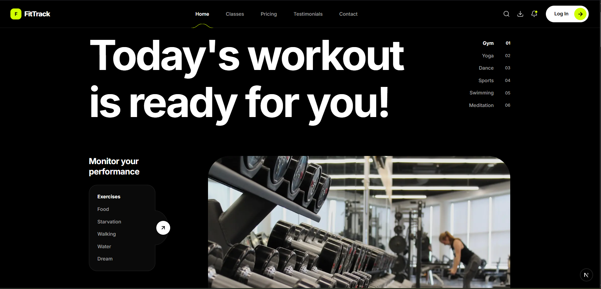
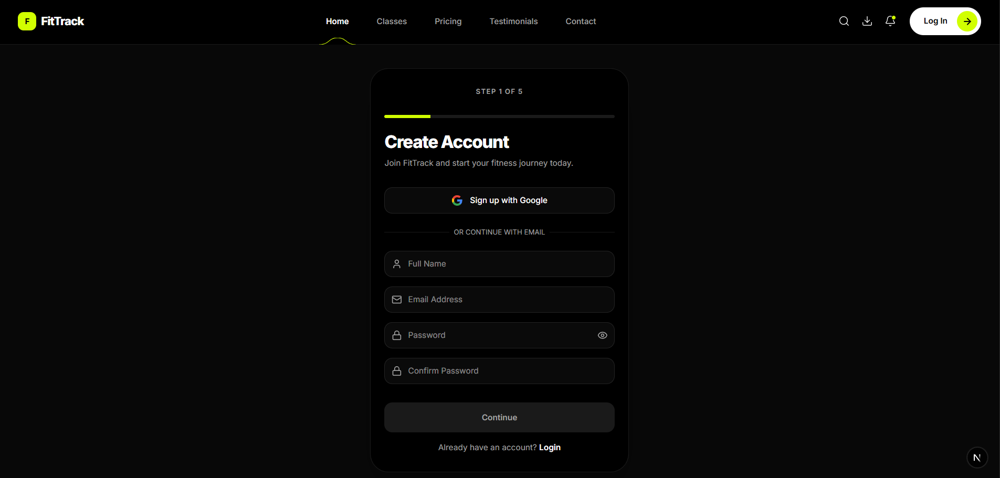
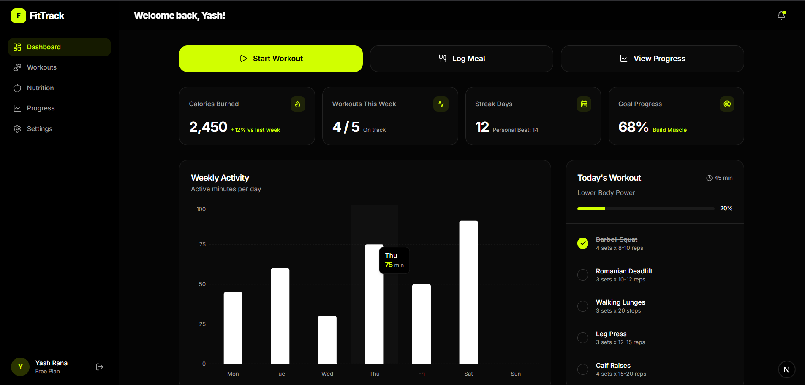

# 🏃 FitTrack Client

> **Next.js 16 frontend for the FitTrack fitness tracking platform.**
> A premium, animated, fully-responsive UI — from marketing landing page through multi-step onboarding to the live fitness dashboard.

---

## Table of Contents

- [Screenshots](#screenshots)
- [Tech Stack](#tech-stack)
- [Architecture](#architecture)
- [Folder Structure](#folder-structure)
- [Getting Started](#getting-started)
- [Environment Variables](#environment-variables)
- [Pages & Routes](#pages--routes)
- [Component Guide](#component-guide)
- [State Management](#state-management)
- [Design Decisions](#design-decisions)

---

## Screenshots

### 🏠 Landing / Hero


### 🧭 Onboarding


### 📊 Dashboard


---

## Tech Stack

| Layer              | Technology                              | Version   |
|--------------------|-----------------------------------------|-----------|
| Framework          | Next.js (App Router)                    | 16.x      |
| Language           | TypeScript                              | 5.x       |
| Styling            | Tailwind CSS v4                         | 4.x       |
| Component Library  | Shadcn/UI (Radix UI primitives)         | latest    |
| Animations         | Framer Motion                           | 12.x      |
| Charts             | Recharts                                | 3.x       |
| Forms              | React Hook Form + Zod                   | 7.x / 4.x |
| Global State       | Zustand                                 | 5.x       |
| Icons              | Lucide React                            | 1.x       |
| Confetti           | canvas-confetti                         | 1.x       |
| Package Manager    | pnpm                                    | latest    |

---

## Architecture

The app uses **Next.js App Router** with route groups to co-locate layouts without affecting URL paths:

```
(marketing)/     → Landing page, Login, Join — public, no auth layout
(app)/           → Dashboard — authenticated, sidebar layout
```

### Data Flow

```
Component → apiClient → fetch() → Express API → PostgreSQL
                ↑
         JWT from localStorage
         (set by ApiClient.setToken)
```

The `ApiClient` class (`lib/api-client.ts`) is a thin, typed wrapper around `fetch`. It automatically:
- Reads the JWT from `localStorage` on every request
- Injects the `Authorization: Bearer <token>` header
- Throws typed errors on non-2xx responses

### Rendering Strategy

| Section        | Strategy                        | Reason                                      |
|----------------|---------------------------------|---------------------------------------------|
| Landing page   | Server Component (static)       | SEO-critical, no user data needed           |
| Onboarding     | Client Component (`"use client"`) | Multi-step state, animations                |
| Dashboard      | Client Component (`"use client"`) | Real-time stats, user-specific data         |
| Charts         | Dynamic import (`ssr: false`)   | Recharts requires `window` — no SSR         |

---

## Folder Structure

```
client/
├── app/
│   ├── layout.tsx                  # Root layout (font, global CSS)
│   ├── globals.css                 # Design tokens, Tailwind base
│   ├── (marketing)/                # Public route group
│   │   ├── layout.tsx              # Navbar + Footer wrapper
│   │   ├── page.tsx                # Landing page (/)
│   │   ├── login/page.tsx          # /login
│   │   └── join/page.tsx           # /join (onboarding entry)
│   └── (app)/                      # Authenticated route group
│       ├── layout.tsx              # Sidebar + dashboard shell
│       └── dashboard/page.tsx      # /dashboard
│
├── components/
│   ├── landing/                    # Landing page sections
│   │   ├── Hero.tsx                # Asymmetric hero with floating monitors
│   │   ├── FeaturesSection.tsx     # Feature highlights
│   │   ├── FeaturesGrid.tsx        # Feature cards grid
│   │   ├── FeatureCard.tsx
│   │   ├── HowItWorks.tsx          # 3-step explainer
│   │   ├── TestimonialCarousel.tsx # Auto-scrolling testimonials
│   │   ├── TestimonialCard.tsx
│   │   ├── Pricing.tsx             # Pricing section
│   │   ├── PricingCard.tsx
│   │   └── CTASection.tsx          # Bottom call-to-action
│   │
│   ├── onboarding/                 # Multi-step onboarding flow
│   │   ├── OnboardingContainer.tsx # Step orchestrator + progress bar
│   │   ├── Step1Account.tsx        # Name, email, password + strength indicator
│   │   ├── Step2Details.tsx        # DOB, gender, height, weight
│   │   ├── Step3Goals.tsx          # Fitness goal selection (multi-select cards)
│   │   ├── Step4Activity.tsx       # Activity level selection
│   │   ├── Step5Profile.tsx        # Username, bio, avatar URL
│   │   └── WelcomeSuccess.tsx      # Confetti celebration screen
│   │
│   ├── dashboard/                  # Dashboard widgets
│   │   ├── DashboardLayout.tsx     # Sidebar + header shell
│   │   ├── StatsGrid.tsx           # Metric cards grid
│   │   ├── StatCard.tsx            # Individual metric card (value + progress ring)
│   │   ├── ActivityChart.tsx       # Recharts bar chart (weekly activity)
│   │   └── WorkoutList.tsx         # Recent workouts list
│   │
│   ├── layout/
│   │   ├── Navbar.tsx              # Sticky glass-morphism nav
│   │   └── Footer.tsx
│   │
│   └── ui/                         # Shadcn/Radix UI primitives
│       └── (button, input, card, dialog, etc.)
│
├── hooks/
│   └── use-scroll.ts               # Scroll position for navbar transparency
│
├── store/
│   └── useOnboardingStore.ts       # Zustand: step index + accumulated form data
│
├── lib/
│   ├── api-client.ts               # Typed fetch wrapper (auto-injects JWT)
│   ├── utils.ts                    # cn() (tailwind-merge + clsx)
│   └── constants/                  # Static app constants
│
└── public/                         # Static assets
```

---

## Getting Started

### Prerequisites

- Node.js ≥ 20
- `pnpm` (`npm install -g pnpm`)
- The [API server](../api/README.md) running on `http://localhost:5000`

### Installation

```bash
cd client
pnpm install
```

### Development Server

```bash
pnpm dev
# → Next.js dev server
# → http://localhost:3000
```

### Production Build

```bash
pnpm build
pnpm start
```

---

## Environment Variables

Create a `.env.local` file in `client/`:

```env
NEXT_PUBLIC_API_URL=http://localhost:5000/api/v1
```

This is the only env var required. It is injected into the browser-side `ApiClient` — if omitted, the client defaults to `http://localhost:5000/api/v1`.

---

## Pages & Routes

| URL           | Route Group    | Component                              | Auth |
|---------------|----------------|----------------------------------------|------|
| `/`           | `(marketing)`  | Landing page                           | ❌    |
| `/login`      | `(marketing)`  | Login form                             | ❌    |
| `/join`       | `(marketing)`  | Onboarding entry (Step 1)              | ❌    |
| `/dashboard`  | `(app)`        | Fitness dashboard                      | ✅    |

---

## Component Guide

### OnboardingContainer

The orchestrator for the 5-step flow. Reads `activeStep` from the Zustand store and conditionally renders each step component wrapped in Framer Motion's `AnimatePresence` for slide transitions. Renders `WelcomeSuccess` when `activeStep > totalSteps`.

### Step Components (1–5)

Each step is a self-contained form:
- Uses **React Hook Form** with a Zod schema for real-time validation
- On submit, calls `apiClient.post` or `apiClient.patch` as appropriate
- On success, stores the returned data in the Zustand store via `updateData()` and advances the step with `nextStep()`
- On error, surfaces API error messages inline

| Step | API Call                                 | Key Fields                              |
|------|------------------------------------------|-----------------------------------------|
| 1    | `POST /auth/signup`                      | name, email, password                   |
| 2    | `PATCH /users/onboarding` (`step: 2`)    | dateOfBirth, gender, height, weight     |
| 3    | `PATCH /users/onboarding` (`step: 3`)    | goals[] (multi-select cards)            |
| 4    | `PATCH /users/onboarding` (`step: 4`)    | activityLevel (skippable)               |
| 5    | `PATCH /users/onboarding` (`step: 5`)    | username, bio, avatarUrl (skippable)    |

### Dashboard Page

Renders a skeleton loader for 1.2 seconds (simulating an API fetch), then reveals:
- **Quick Actions** — Start Workout, Log Meal, View Progress (animated buttons)
- **StatsGrid** — Four metric cards from `GET /stats/overview`
- **ActivityChart** — 7-day bar chart from `GET /stats/weekly-activity`
- **WorkoutList** — Recent session history

### ActivityChart

Recharts `BarChart` dynamically imported with `ssr: false`. Renders dual bars (active minutes + calories) for each of the last 7 days with custom tooltips and a responsive container.

### StatCard

Displays a single metric (calories, steps, water, sleep) with:
- Large value + unit label
- Circular SVG progress ring
- Subtitle showing goal (e.g. "of 2,000 kcal")
- Framer Motion entrance animation with staggered delay

---

## State Management

### Zustand — `useOnboardingStore`

The onboarding flow accumulates data across steps without routing or query params:

```ts
interface OnboardingState {
  activeStep: number;       // 1–5 (6+ → WelcomeSuccess)
  totalSteps: number;       // 5
  data: Partial<OnboardingData>;  // accumulated form values
  nextStep(): void;
  prevStep(): void;
  updateData(newData): void;
  setStep(step): void;
}
```

- `data` is built up step-by-step and never cleared mid-flow
- `setStep` is clamped to `[1, totalSteps]` to prevent invalid states

### JWT Persistence

The `ApiClient` stores and reads the JWT from `localStorage` under the key `fittrack_token`. This persists across page refreshes without a separate auth context provider.

---

## Design Decisions

### 1. Glassmorphism Navbar
The sticky navbar uses `backdrop-blur` + semi-transparent background that transitions from fully transparent (on the hero) to a frosted glass appearance on scroll. Driven by the `use-scroll` hook.

### 2. Framer Motion Orchestration
- `AnimatePresence` wraps the onboarding step switcher for smooth enter/exit slide animations
- Dashboard cards use `initial → animate` with staggered `delay: i * 0.1` for a cascading reveal
- Quick action buttons use `whileHover={{ y: -4 }}` and `whileTap={{ scale: 0.98 }}` for tactile feedback

### 3. Skeleton-First Loading
The dashboard renders `DashboardSkeleton` (animated `bg-muted/50` placeholders matching exact grid layout) before data arrives, preventing layout shift and providing instant visual feedback.

### 4. Password Strength Indicator
Step 1 computes a live password strength score (Weak / Fair / Strong / Very Strong) based on length, character classes, and entropy — rendered as a coloured progress bar below the input field.

### 5. Per-Step Zod Schemas Mirror the API
Frontend Zod schemas are kept intentionally parallel to the backend schemas. This means validation errors shown in the UI match what the API would reject, and form data maps directly to API request bodies without transformation.

### 6. Route Groups for Layout Isolation
`(marketing)/layout.tsx` and `(app)/layout.tsx` are separate layouts that don't affect URL structure. The marketing layout includes Navbar + Footer; the app layout includes the sidebar dashboard shell.

### 7. WelcomeSuccess Confetti
When `activeStep` exceeds `totalSteps`, `WelcomeSuccess` fires `canvas-confetti` with a staggered burst sequence for a delightful end-of-onboarding celebration.

### 8. Responsive Strategy

| Breakpoint | Dashboard                         | Landing                          |
|------------|-----------------------------------|----------------------------------|
| Mobile     | Single-column stack, bottom nav   | Full-screen onboarding cards     |
| Tablet     | 2-column stats grid               | 2-column feature grid            |
| Desktop    | 4-column stats, sidebar permanent | Asymmetric hero, 3-column grid   |
